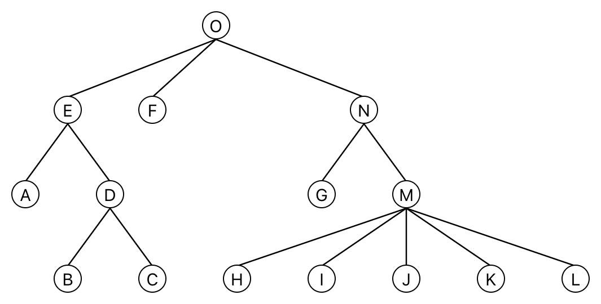

# M-Ary Tree

An implementation of an [m-ary tree](https://en.wikipedia.org/wiki/M-ary_tree) in TypeScript.

---

## Usage

For detailed use see the [API Documentation](./API.md)

### Basic

```typescript
const tree = new MAryTree(0);

tree.insert(0, 1);
tree.insert(0, 2);
```

### Keys

Each node inserted should have a unique key. Values are optional.

```typescript
const tree = new MAryTree(1);

tree.insert(0, 1)          // node with key 1 and no value
tree.insert(0, 2, 'foo')   // node with key 2 and value foo
```

### Binary / Ternary Trees

Use `maxChildren` option to limit child nodes, thus producing binary or ternary trees etc.

```typescript
const tree = new MAryTree(1, null, {
  maxChildren: 2,
});
```

### Traversals

All traversals are implemented as generators.

```typescript
for (const node of tree.postOrderTraversal()) {
  // ...
}
```

### Generic Types

TypeScript generics are supported:

```typescript
type MyNodeType = {
  data: string;
}

const tree = new MAryTree<number, MyNodeType>(0, { data: 'foo' });
```

## Motivation

This data structure was created while implementing the algorithm described in [Node-Positioning Algorithm for General Trees](https://www.cs.unc.edu/techreports/89-034.pdf) by John Q. Walker.

Also included is a utility `calculateCoordinates` which will allow you calculate X and Y coordinates for trees following the program outlined in that paper.

```typescript
import calculateCoordinates, { MAryTreeValuePositioned } from "m-ary-tree/dist/calculateCoordinates";
import { MAryTree } from "m-ary-tree";

const tree = new MAryTree<string, MAryTreeValuePositioned>('O');

tree.insert('O', 'E');
tree.insert('O', 'F');
tree.insert('O', 'N');

tree.insert('E', 'A');
tree.insert('E', 'D');

tree.insert('D', 'B');
tree.insert('D', 'C');

tree.insert('N', 'G');
tree.insert('N', 'M');

tree.insert('M', 'H');
tree.insert('M', 'I');
tree.insert('M', 'J');
tree.insert('M', 'K');
tree.insert('M', 'L');

calculateCoordinates(tree);
```

Each node will have `node.value.x` and `node.value.y` set accordingly. Drawing the above tree will produce the following:


