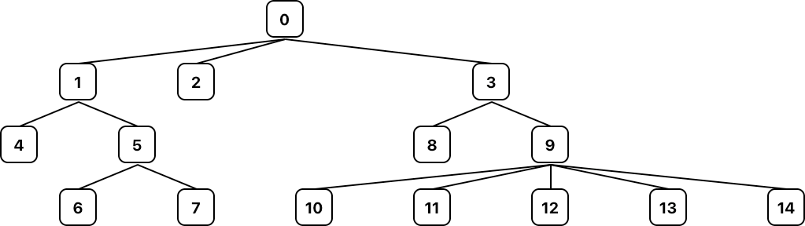
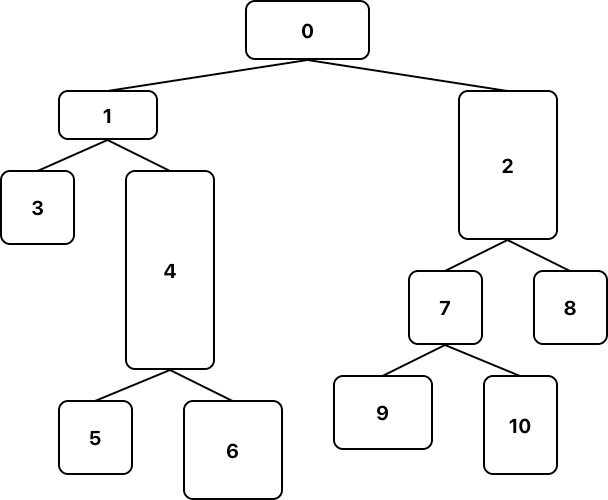

# M-Ary Tree

An implementation of an [m-ary tree](https://en.wikipedia.org/wiki/M-ary_tree) in TypeScript.


---

## Install

```bash
yarn add m-ary-tree
```

```bash
npm install m-ary-tree
```

## Usage

For detailed use see the [API Documentation](./API.md)

### Basic

```typescript
const tree = new MAryTree(0);

tree.insert(0, 1);
tree.insert(0, 2);
```

### Keys

Each node inserted should have a unique key. Values are optional.

```typescript
const tree = new MAryTree(0);

tree.insert(0, 1)          // node with key 1 and no value
tree.insert(0, 2, 'foo')   // node with key 2 and value foo
```

### Binary / Ternary Trees

Use `maxChildren` option to limit child nodes, thus producing binary or ternary trees etc.

```typescript
const tree = new MAryTree(1, null, {
  maxChildren: 2,
});
```

### Traversals

All traversals are implemented as generators.

```typescript
for (const node of tree.postOrderTraversal()) {
  // ...
}
```

### Generic Types

TypeScript generics are supported:

```typescript
type MyNodeType = {
  data: string;
}

const tree = new Tree<number, MyNodeType>(0, { data: 'foo' });

console.log(tree.root.value.data) // 'foo'
```

## Motivation

This library was created while experimenting with tree drawing algorithms.

There are currently two positioning algorithms, based on these papers:

- [Node-Positioning Algorithm for General Trees](https://www.cs.unc.edu/techreports/89-034.pdf) by John Q. Walker
- [Drawing Non-layered Tidy Trees in Linear Time](https://core.ac.uk/download/pdf/301654972.pdf) by Atze van der Ploeg


```typescript
import calculateCoordinates, { MAryTreeValuePositioned } from "m-ary-tree/dist/positioning-algorithms/Walker/calculateCoordinates";
import { Tree } from "m-ary-tree";

const tree = new Tree<number, TreeValuePositioned>(0);

tree.insert(0, 1);
tree.insert(0, 2);
tree.insert(0, 3);

calculateCoordinates(tree, {
  nodeWidth: 50,
  nodeHeight: 50,
  nodeSpacingX: 100,
  nodeSpacingY: 30,
});
```

Nodes will have `node.value.x` and `node.value.y` set accordingly.

### Walker's Tree


### Ploeg's Tree


